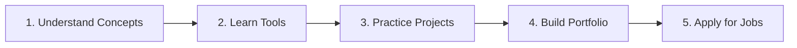

Author : Hanssi Andrianiaina RASOLOMANANA 

Updated : 2025-07-29

---

# 📊 Beginner's Guide to Data Analytics

This is a foundational course for aspiring data professionals, inteded to equip you with the essential skills and knowledge in data analytics.

## Table of Contents
- [📊 Beginner's Guide to Data Analytics](#-beginners-guide-to-data-analytics)
  - [Table of Contents](#table-of-contents)
  - [🧭 Course Overview](#-course-overview)
  - [📘 Module 1: What is Data Analytics?](#-module-1-what-is-data-analytics)
  - [🎯 Module 2: What is the Goal of Data Analytics?](#-module-2-what-is-the-goal-of-data-analytics)
  - [🧱 Module 3: Common Approach to Data Analytics](#-module-3-common-approach-to-data-analytics)
    - [Data Analytics Pipeline](#data-analytics-pipeline)
    - [Key Steps:](#key-steps)
  - [🛠️ Module 4: Common Tools \& Technologies](#️-module-4-common-tools--technologies)
    - [Languages:](#languages)
    - [Tools:](#tools)
  - [💡 Module 5: Business Value of Data Analytics](#-module-5-business-value-of-data-analytics)
  - [🧪 Module 6: How to Get Hands-On](#-module-6-how-to-get-hands-on)
    - [Beginner-Friendly Platforms:](#beginner-friendly-platforms)
  - [🔁 Suggested Learning Path](#-suggested-learning-path)

## 🧭 Course Overview
Welcome to this beginner course on Data Analytics. This course is designed to help you understand:

- What data analytics is
- Why it’s important
- How it's done
- The technologies and tools involved
- Real-world business value
- How to gain hands-on experience

## 📘 Module 1: What is Data Analytics?

**Definition:**

Data analytics is the process of examining raw data to extract meaningful insights, identify patterns, and support decision-making.

**Types of Data Analytics:**

| Type             | Description          | Example                          |
| ---------------- | -------------------- | -------------------------------- |
| **Descriptive**  | What happened?       | Monthly report (sales, performance activities, ...)             |
| **Diagnostic**   | Why did it happen?   | Performances analysis (e.g : sales, ...)              |
| **Predictive**   | What will happen?    | Forecasting, simulation : future sales, business rules changes, budget allocation        |
| **Prescriptive** | What should be done? | Recommendation |

**📚 Further Reading:**

- [IBM: What is Data Analytics?](https://www.ibm.com/topics/data-analytics)
- [Tableau: Types of Data Analytics](https://www.tableau.com/learn/articles/fundamentals-data-analytics)

## 🎯 Module 2: What is the Goal of Data Analytics?

- Support decision-making: Guide leadership with facts
- Improve performance: Optimize processes
- Understand customers: Segment, personalize, retain
- Identify opportunities: Spot trends and patterns

**💼 Example:**

Netflix uses analytics to recommend shows, predict content popularity, and optimize production planning.

## 🧱 Module 3: Common Approach to Data Analytics

### Data Analytics Pipeline

### Key Steps:

- Collect Data – from databases, APIs, spreadsheets
- Clean Data – handle missing values, duplicates, format
- Explore Data – identify trends, outliers, summary stats
- Analyze Data – use models, visualizations, or tests
- Report Insights – dashboards, reports, presentations

**📚 Further Reading:**

[Towards Data Science: The Data Analysis Process](https://towardsdatascience.com/data-analysis-process-steps-5dc84f90df6e)

## 🛠️ Module 4: Common Tools & Technologies

### Languages:
- Python – with pandas, numpy, matplotlib, scikit-learn
- R – popular in academic and statistical circles
- SQL – for querying databases

### Tools: 

| Category            | Tools                         |
| ------------------- | ----------------------------- |
| Data Collection     | APIs, SQL, Web Scraping, bucket S3       |
| Data Wrangling      | Pandas, Power Query, Spark           |
| Visualization       | Tableau, Power BI, Matplotlib, seaborn, ggplot |
| Analytics Platforms | Excel, Google Data Studio, Jupyter Lab, Posit     |
| Cloud Platforms     | AWS, GCP, Azure               |

**📚 Learning Resources:**

- [Python Data Analytics by Google](https://developers.google.com/learn/pathways/data-analytics-python)
- [Tableau Public Training](https://www.tableau.com/learn/training)

## 💡 Module 5: Business Value of Data Analytics

This module explores how data analytics drives business value across various domains. It does not encompass all possible use cases, but highlights some key areas where analytics can make a significant impact.

| Domain         | Use Case Example                                    |
| -------------- | --------------------------------------------------- |
| **Retail**     | Inventory forecasting, personalized recommendations |
| **Finance**    | Credit scoring, fraud detection                     |
| **Healthcare** | Patient monitoring, treatment optimization          |
| **Telecom**    | Churn prediction, network optimization              |
| **Marketing**  | Campaign effectiveness, customer segmentation       |

**🎯 Impact:**

- Informed decision-making
- Revenue optimization
- Cost reduction
- Risk mitigation

**📚 Further Reading:**

[McKinsey: The age of analytics](https://www.mckinsey.com/business-functions/mckinsey-digital/our-insights/the-age-of-analytics)

## 🧪 Module 6: How to Get Hands-On

### Beginner-Friendly Platforms:

- [Google Colab](https://colab.research.google.com/) – free notebooks
- [Kaggle](https://www.kaggle.com/) – datasets, competitions, kernels
- [Mode Analytics SQL Tutorial](https://mode.com/sql-tutorial/)
- [Power BI Guided Learning](https://learn.microsoft.com/en-us/training/powerplatform/power-bi/)

Practice Datasets:

- [UCI Machine Learning Repository](https://archive.ics.uci.edu/ml/index.php)
- [Awesome Public Datasets](https://github.com/awesomedata/awesome-public-datasets)
- [data.gov](https://data.gov)

## 🔁 Suggested Learning Path

Start with small projects, gradually increase complexity, and showcase your work on platforms like GitHub or LinkedIn.

You can use Google Colab or Jupyter Notebooks to start with your projects, share insights, and visualize data. The basic stack of Python with libraries like pandas, matplotlib, and seaborn is a great starting point for data analysis, along with SQL for data querying.

Then after you feel comfortable, you can explore more advanced tools like Tableau or Power BI for visualization, and build automated dashboards.